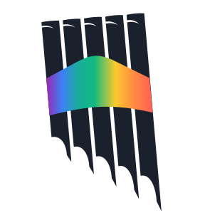
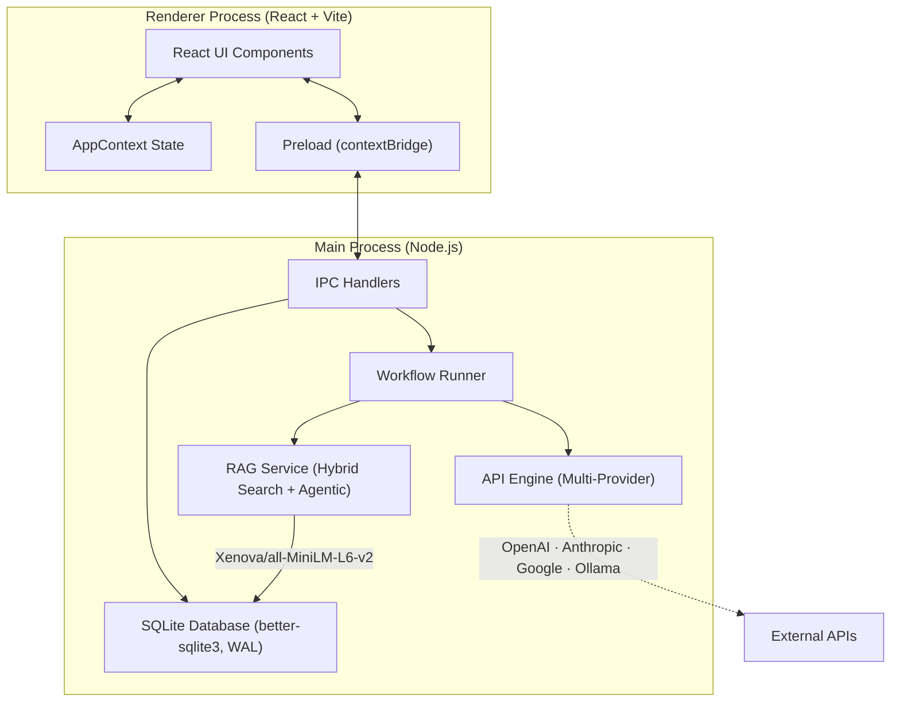

<div align="center">

<p align="center">
  
</p>

### Craft the mind. Chain the thought.

A **bring-your-own-key** desktop platform that puts you in full control of AI — build custom personas, feed them your own knowledge, chain them into multi-step workflows, and let them remember everything. No cloud lock-in, no subscriptions, no limits.

**Built with Electron · React · Vite · SQLite · Hugging Face Transformers**

[](https://www.electronjs.org/)
[](https://react.dev/)
[](https://www.sqlite.org/)
[](LICENSE)
[](https://discord.com/invite/CE4C9JRS9H)
[](https://github.com/Kallamo/Kallamo)

</div>


---

## Why Kallamo?



Most AI tools are thin wrappers around a single API call. Kallamo is different — it's an **orchestration platform** that lets you design *how AI thinks*, not just what it says.

While developer-focused tools like Claude Code and Cursor serve the coding world, **Kallamo is built for everyone else** — writers, game masters, project managers, content creators, researchers, students, and anyone who wants to get more out of AI without writing a single line of code.

- **Build any AI persona** — A creative writing assistant. An RPG narrator. A project planner. A documentation specialist. A daily task organizer. The same platform, infinite use cases.
- **Chain multiple personas** into sequential workflows where each step feeds the next.
- **Ground every response** in your own documents and reference material through a local hybrid RAG engine.
- **Never lose context** — an automatic memory system archives and vectorizes old conversations so they remain searchable forever.
- **Own your data** — everything runs locally on your machine. No cloud dependency, no subscriptions, no data harvesting.

---

## Download

> **🚀 Just want to use Kallamo?** Download the pre-compiled installer for your operating system:
>
> **[⬇ Download Kallamo (Windows, macOS, Linux)](https://github.com/Kallamo/Kallamo/releases/latest)**
> 
> - **Windows:** Download and run the `Kallamo Setup X.X.X.exe` installer.
> - **macOS:** Download and open the `Kallamo-X.X.X.dmg` disk image.
> - **Linux:** Download the universal `Kallamo-X.X.X.AppImage` (make it executable and run) or the Debian package `kallamo_X.X.X_amd64.deb` (Ubuntu/Debian).
>
> Once installed, Kallamo will **automatically check for updates** in the background and notify you when a new version is available.

Looking to build from source instead? See [Developer Setup](#developer-setup) below.

---

## Key Features

### 🔗 Multi-Step AI Workflows

Define linear chains of AI profiles where the output of one step becomes the input of the next. A "Research → Analyze → Draft → Review" pipeline runs as a single action, with each step using its own system prompt, model, temperature, and knowledge base. Use it for creative writing, business analysis, study notes, or anything that benefits from structured multi-pass AI processing.

### 🧠 Hybrid RAG Engine (Retrieval-Augmented Generation)

Every AI profile can be backed by a local knowledge base. Feed it your RPG lorebooks, company SOPs, research papers, project briefs, or personal notes — files (`.pdf`, `.docx`, `.txt`) are chunked, vectorized using `Xenova/all-MiniLM-L6-v2`, and stored in SQLite. At query time, a **Reciprocal Rank Fusion** algorithm merges dense vector search (cosine similarity) with sparse keyword search (FTS5 BM25) to surface the most relevant context.

### 🤖 Agentic RAG Mode

For profiles that need deeper research, Kallamo can run an autonomous **Thought → Action** retrieval loop. The agent decides which knowledge bases to search, which files to read in full, and which memories to recall — then synthesizes a research brief before the main generation step. Capped at 2 turns for cost efficiency.

### 💾 Smart Chat Memory & Auto-Archiving

When a conversation grows beyond a configurable token threshold, Kallamo automatically archives older messages into vectorized memory blocks. These blocks remain semantically searchable — the AI can recall details from thousands of messages ago without ever hitting context limits.

### 📦 Portable AI Profiles & Workflows

Export any AI profile (system prompt, knowledge base files, manual snippets) as a `.klp` package, any workflow chain as a `.klw` package, or any knowledge base independently as a `.klkb` package. Import them on another machine or share them with your community. A game master can share their RPG narrator profile; a team lead can distribute a project planning assistant — complete with all their knowledge and configuration.

### 🔌 Bring Your Own Key — Multi-Provider API Engine

Kallamo doesn't sell AI access — you connect your own API keys. Support for **OpenAI**, **Anthropic**, **Google AI**, **Vertex AI**, **AWS Bedrock**, **OpenRouter**, or any **local server** (Ollama, LM Studio). Use the cheapest model for brainstorming and the most powerful one for final output — all within the same workflow. All keys are encrypted at rest using Electron's `safeStorage`. Dynamic variables (`{{variable}}`) are resolved at runtime across all prompts.

### 🔄 Silent Auto-Updates

Once installed, Kallamo checks for updates in the background via GitHub Releases. When a new version is downloaded, you'll see a notification inside the app — one click to restart and install. No manual re-download needed.

### 🎨 Atmospheric Workspace Customization

Kallamo is built to match the mood of whatever you are writing. You can customize the interface of each individual Workspace to create the perfect distraction-free environment:
- **Custom Background Wallpapers:** Set a unique background image for each workspace (e.g., cyberpunk art for sci-fi, oil paintings for fantasy, or dark textures for horror) to immerse yourself in your project.
- **Glassmorphic Message Opacity:** Individually adjust the transparency of both User and AI message boxes (from solid down to fully transparent) to blend them beautifully into your background.
- **Tailored Typography:** Choose between modern Sans-serif, elegant Serif, or clean Monospace fonts, and scale the text size (Small, Medium, Large) to your absolute comfort.
- **Vibrant Accent Colors:** Select one of the 5 pre-configured accent colors (Gold, Emerald, Sapphire, Ruby, or Amethyst) to serve as the theme highlight throughout the app.
- **Code Syntax Themes:** Full syntax highlighting support featuring popular color schemes (Atom One Dark, GitHub Dark, Tokyo Night) for technical notes and codeblocks.

---

## System Architecture

Kallamo follows Electron's two-process model with a strict security boundary between the renderer and the backend.



| Layer | Responsibility | Key Files |
|-------|---------------|-----------|
| **Renderer** | React UI, state management, user interactions | `App.jsx`, `AppContext.jsx`, component tree |
| **Preload** | Secure IPC bridge via `contextBridge` | `preload.js` |
| **IPC Handlers** | CRUD operations, file indexing, import/export | `ipc-handlers.js` |
| **Workflow Runner** | Orchestrates multi-step prompt chains with error recovery | `workflow-runner.js` |
| **RAG Service** | Chunking, vectorization, hybrid search, memory management | `rag-service.js` |
| **API Engine** | Provider-specific request formatting, auth, response parsing | `api-engine.js` |
| **Database** | Schema definition, migrations, encryption helpers | `database.js` |

> 📖 **Deep dive →** [Architecture Documentation](docs/architecture.md) covers the database schema, RAG math, agentic loop internals, and context archiving in full detail.

---

## Developer Setup

> This section is for contributors and developers who want to build Kallamo from source.
> If you just want to use the app, download the installer from [Releases](https://github.com/Kallamo/Kallamo/releases/latest).

### Prerequisites

- **Node.js** ≥ 18
- **Python** ≥ 3.10 and C++ Build Tools (required by `better-sqlite3` native compilation)
  - Windows: `npm install --global windows-build-tools` or install Visual Studio Build Tools
  - macOS: `xcode-select --install`
  - Linux: `sudo apt-get install build-essential python3`

### Installation

```bash
# Clone the repository
git clone https://github.com/Kallamo/Kallamo.git
cd Kallamo

# Install dependencies (includes native SQLite rebuild)
npm install

# Rebuild native modules for Electron
npx @electron/rebuild
```

### Development

```bash
# Start Vite dev server + Electron concurrently
npm run electron:dev
```

This launches the Vite HMR server on `localhost:5173` and opens Electron pointing to it. Changes to React components are reflected instantly.

### Building

```bash
# Build the Vite bundle and launch Electron from dist/
npm run start

# Generate a portable unpacked build (for testing)
npm run pack

# Generate the full NSIS installer (.exe) + auto-update metadata
npm run dist
```

The `npm run dist` command produces the `Kallamo Setup X.X.X.exe` installer and the `latest.yml` metadata file inside the `release/` directory.

---

## Project Structure

```
Kallamo/
├── src/
│   ├── main.js                  # Electron entry point, window management
│   ├── preload.js               # Secure IPC bridge (contextBridge)
│   ├── main/
│   │   ├── database.js          # SQLite schema, migrations, encryption
│   │   ├── api-engine.js        # Multi-provider API client
│   │   ├── workflow-runner.js   # Linear chain executor
│   │   ├── rag-service.js       # Vector engine & hybrid search
│   │   └── ipc-handlers.js      # All IPC endpoint definitions
│   ├── renderer/
│   │   ├── App.jsx              # Root layout, global effects
│   │   ├── main.jsx             # React DOM entry
│   │   ├── index.html           # HTML shell
│   │   ├── index.css            # Global styles (Tailwind v4)
│   │   ├── context/             # React Context (AppProvider)
│   │   ├── components/          # UI components
│   │   └── utils/               # Client-side utilities
│   └── assets/                  # Icons and static assets
├── docs/
│   ├── architecture.md          # System architecture deep dive
│   └── workflows.md             # Workflow & packaging guide
├── release/                     # Build output (installer, unpacked app)
├── vite.config.js               # Vite build configuration
└── package.json
```

---

## Tech Stack

| Category | Technology | Purpose |
|----------|-----------|---------|
| **Runtime** | Electron 31 | Desktop shell, native OS integration |
| **Frontend** | React 19, Vite 8 | UI rendering, hot module replacement |
| **Styling** | Tailwind CSS v4 | Utility-first CSS framework |
| **Database** | better-sqlite3 (WAL mode) | Synchronous SQLite with FTS5 support |
| **Embeddings** | `@huggingface/transformers` | Local vector embeddings (MiniLM-L6-v2) |
| **Document Parsing** | mammoth, unpdf | DOCX and PDF text extraction |
| **Packaging** | adm-zip | `.klp` / `.klw` / `.klkb` profile and workflow export/import |
| **Installer** | electron-builder (NSIS) | Windows installer generation |
| **Auto-Update** | electron-updater | Silent updates via GitHub Releases |
| **Code Highlighting** | highlight.js | Syntax highlighting in chat messages |
| **Icons** | lucide-react | Consistent SVG icon set |

---

## Documentation

| Document | Description |
|----------|-------------|
| [Architecture](docs/architecture.md) | Database schema, RAG internals, agentic loop, context archiving |
| [Workflows](docs/workflows.md) | Multi-step chains, profile packaging, `.klp` / `.klw` / `.klkb` format |

---

## Community

Have a question, found a bug, or want to share what you've built with Kallamo?

- 💬 **[Join the Discord](https://discord.com/invite/CE4C9JRS9H)** — Chat with the community, get help, and share your AI profiles and workflows.
- 🐛 **[Open an Issue](https://github.com/Kallamo/Kallamo/issues)** — Report bugs or request features on GitHub.
- ⭐ **[Star the Repo](https://github.com/Kallamo/Kallamo)** — If Kallamo is useful to you, a star helps others discover it.

---

## License & Contributing

This project is licensed under the [GNU AGPLv3 License](LICENSE).

### Trademark Notice
The name **Kallamo**, the Kallamo logo, and all associated branding assets are trademarks of the project creator. While the source code is freely available under the AGPLv3 license, this license does **not** grant you any rights to use the project's name, logos, or brand identity for your own forks or commercial distributions. Any modified versions or forks of this software must be renamed and rebranded to avoid user confusion.

### Contributor License Agreement (CLA)
All contributors to this project must review and accept the [Kallamo Contributor License Agreement (CLA)](CLA.md) before their contributions can be merged.
