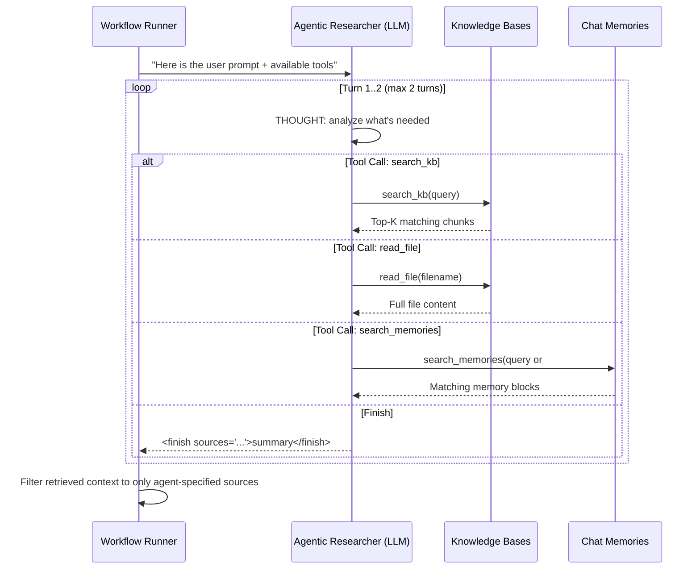

# System Architecture

> Technical reference for the internal design of Kallamo — the AI orchestration platform.

---

## Table of Contents

- [Process Model](#process-model)
- [Database Schema](#database-schema)
- [Hybrid RAG Engine](#hybrid-rag-engine)
- [Agentic RAG Loop](#agentic-rag-loop)
- [Context Archiving & Auto-Summarization](#context-archiving--auto-summarization)
- [API Engine & Provider Matrix](#api-engine--provider-matrix)
- [Security Model](#security-model)

---

## Process Model

Kallamo runs on Electron's two-process architecture with strict context isolation enabled.

### Main Process (`src/main.js`)

The Node.js backend handles all privileged operations:

| Module | File | Responsibility |
|--------|------|----------------|
| **Entry Point** | `main.js` | Window creation, custom `app-file://` protocol registration, dev/prod URL routing |
| **Database** | `main/database.js` | Schema definition, WAL mode, migrations, `safeStorage` encryption helpers |
| **IPC Handlers** | `main/ipc-handlers.js` | 50+ `ipcMain.handle()` endpoints for CRUD, file indexing, import/export |
| **Workflow Runner** | `main/workflow-runner.js` | Linear chain orchestration, error recovery modals, context overflow detection |
| **RAG Service** | `main/rag-service.js` | Text chunking, embedding generation, hybrid search, memory persistence |
| **API Engine** | `main/api-engine.js` | Multi-provider HTTP client with dynamic variable resolution |

### Renderer Process (`src/renderer/`)

A React 19 application built with Vite 8 and Tailwind CSS v4:

| Module | File | Responsibility |
|--------|------|----------------|
| **App Shell** | `App.jsx` | Global layout, tooltip engine, toast system, modal orchestration |
| **State** | `context/AppContext.jsx` | Centralized React Context with all application state |
| **Views** | `components/DashboardView.jsx`, `LibraryView.jsx`, `ChatWorkspaceView.jsx` | Main navigation panels |
| **Modals** | `components/modals/` | Settings, workflow errors, context overflow prompts |

### IPC Bridge (`src/preload.js`)

The preload script uses Electron's `contextBridge` to expose a controlled `window.electronAPI` object. The renderer never has direct access to Node.js APIs or the filesystem.

```
Renderer (React)
    ↓ window.electronAPI.someMethod(args)
Preload (contextBridge)
    ↓ ipcRenderer.invoke('some-method', args)
Main Process (ipcMain.handle)
    ↓ database / RAG / API operations
    ↑ return result
```

---

## Database Schema

Kallamo uses `better-sqlite3` in WAL (Write-Ahead Logging) mode for concurrent read performance. The database file is stored at:

```
%APPDATA%/Kallamo/kallamo.db        (Windows)
~/Library/Application Support/Kallamo/kallamo.db  (macOS)
~/.local/share/Kallamo/kallamo.db   (Linux)
```

### Core Tables

#### `api_profiles`

Stores API provider credentials. Keys are encrypted via Electron `safeStorage`.

| Column | Type | Description |
|--------|------|-------------|
| `id` | TEXT PK | Unique identifier |
| `name` | TEXT | Display name |
| `provider` | TEXT | `openai`, `anthropic`, `google ai`, `vertex ai`, `aws bedrock`, `openrouter`, `local` |
| `baseUrl` | TEXT | Custom endpoint override |
| `apiKey` | TEXT | Encrypted API key (prefixed `safe:` + base64) |
| `customConfig` | TEXT | Encrypted JSON for provider-specific config (GCP project, AWS region, etc.) |
| `models` | TEXT | JSON array of available model names |

#### `writing_profiles`

AI persona definitions with associated knowledge bases.

| Column | Type | Description |
|--------|------|-------------|
| `id` | TEXT PK | Unique identifier |
| `name` | TEXT | Profile display name |
| `description` | TEXT | Optional description |
| `color` | TEXT | HEX color for UI identification |
| `apiProfileId` | TEXT | FK → `api_profiles.id` |
| `model` | TEXT | Model identifier string |
| `temperature` | REAL | Sampling temperature (0.0–2.0) |
| `maxTokens` | INTEGER | Max output tokens |
| `systemPrompt` | TEXT | System instruction for the AI |
| `knowledgeFiles` | TEXT | JSON array of file metadata objects |
| `manualMode` | INTEGER | Boolean flag: inject raw JSON into API payload |
| `manualJson` | TEXT | Raw JSON override string |
| `isAgentic` | INTEGER | Boolean flag: enable Agentic RAG loop |
| `agenticPrompt` | TEXT | Custom instructions for the agentic researcher |

#### `chats`

Chat workspace configuration and state.

| Column | Type | Description |
|--------|------|-------------|
| `id` | TEXT PK | Unique identifier |
| `title` | TEXT | Workspace title |
| `description` | TEXT | Optional description |
| `maxContext` | INTEGER | Maximum context window in tokens (default: 128,000) |
| `archiveThreshold` | INTEGER | Token count that triggers auto-summarization (default: 60,000) |
| `summarizedIndex` | INTEGER | Index of the oldest non-archived message |
| `activeProfiles` | TEXT | JSON array of active profile IDs |
| `activeWorkflows` | TEXT | JSON array of active workflow IDs |
| `knowledgeFiles` | TEXT | JSON array of chat-scoped knowledge file metadata |
| `memoryBlocks` | TEXT | JSON array of archived memory block objects |
| `autoSummarize` | INTEGER | Boolean flag: enable automatic context archiving |
| `backgroundImage` | TEXT | Path to custom background image |
| `backdropOpacity` | INTEGER | Background overlay opacity (0–100) |

#### `messages`

Individual chat messages with AI attribution.

| Column | Type | Description |
|--------|------|-------------|
| `id` | TEXT PK | Unique identifier |
| `chatId` | TEXT FK | Reference to `chats.id` (CASCADE delete) |
| `role` | TEXT | `user` or `ai` |
| `content` | TEXT | Message body (Markdown supported) |
| `aiName` | TEXT | Name of the AI profile that generated this message |
| `aiColor` | TEXT | HEX color of the generating profile |
| `debugNotice` | TEXT | JSON blob with token usage, RAG diagnostics |
| `attachedFiles` | TEXT | JSON array of file attachment metadata |
| `alternatives` | TEXT | JSON array of alternative AI responses (regenerations) |

#### `workflows`

Multi-step prompt chain definitions.

| Column | Type | Description |
|--------|------|-------------|
| `id` | TEXT PK | Unique identifier |
| `name` | TEXT | Workflow display name |
| `entryProfileId` | TEXT | Default entry point profile |
| `steps` | TEXT | JSON array of step objects |

Each step object:
```json
{
  "profileId": "profile_abc123",
  "prompt": "Additional instruction for this step",
  "includeContext": true
}
```

#### `knowledge_chunks`

Vectorized text chunks for both profile and chat knowledge bases.

| Column | Type | Description |
|--------|------|-------------|
| `id` | TEXT PK | Unique chunk identifier |
| `ownerId` | TEXT | Profile ID or Chat ID |
| `ownerType` | TEXT | `profile_kb`, `chat_kb`, or `chat_memory` |
| `source` | TEXT | Original filename or memory block title |
| `text` | TEXT | Enriched text (`Document: <name>\nContent: <text>`) |
| `vector` | TEXT | JSON-serialized float array (384 dimensions for MiniLM) |
| `createdAt` | INTEGER | Unix timestamp in milliseconds |

**Index:** `idx_knowledge_chunks_owner` on `(ownerId, ownerType)`.

#### `knowledge_chunks_fts` (Virtual Table)

FTS5 full-text search index on chunk text for sparse keyword retrieval.

| Column | Type | Description |
|--------|------|-------------|
| `chunkId` | TEXT | FK → `knowledge_chunks.id` |
| `text` | TEXT | Searchable text content |

#### `variables`

User-defined dynamic variables resolved at runtime in prompts via `{{key}}` syntax.

| Column | Type | Description |
|--------|------|-------------|
| `id` | TEXT PK | Unique identifier |
| `name` | TEXT | Display name |
| `key` | TEXT UNIQUE | Template key (used as `{{key}}` in prompts) |
| `value` | TEXT | Resolved value |
| `description` | TEXT | Optional description |

### Sync Infrastructure

All mutable tables (`chats`, `messages`, `writing_profiles`, `variables`) include:
- `last_modified` (INTEGER) — auto-updated via SQLite triggers on INSERT/UPDATE.
- `syncToCloud` (INTEGER) — flag for cloud sync eligibility.

A `deleted_records` table tracks soft-deleted record IDs for sync conflict resolution.

### Migrations

The database self-migrates on startup:
1. **Schema migrations** — `ALTER TABLE ADD COLUMN` for new fields, guarded by `PRAGMA table_info()` checks.
2. **Data migrations** — JSON-file-to-SQLite migration from the legacy filesystem-based storage.
3. **Vector migrations** — Scans `vector_db.json` files from legacy profile/chat directories and inserts them into `knowledge_chunks`.
4. **Encryption migrations** — Encrypts any plaintext API keys found in `api_profiles` using `safeStorage`.
5. **Branding migrations** — Auto-renames old data directories (`AI Writer Companion` → `Kalamo` → `Kallamo`).

---

## Hybrid RAG Engine

The RAG pipeline uses a **Reciprocal Rank Fusion (RRF)** algorithm to merge two independent retrieval signals.

### Ingestion Pipeline

```
Source File (.pdf, .docx, .txt)
    ↓ extractTextFromFile()
Raw Text
    ↓ chunkText(text, maxChunkSize=500)
Text Chunks (paragraph-aware splitting, min 50 chars)
    ↓ vectorizeChunks()
    ↓ Enrich: "Document: <filename>\nTags: <keywords>\nContent: <chunk>"
    ↓ generateEmbeddingVector() → Xenova/all-MiniLM-L6-v2 (384-dim, quantized)
Vectors + Text
    ↓ insertChunksToDb()
    ↓ INSERT INTO knowledge_chunks (vector as JSON text)
    ↓ INSERT INTO knowledge_chunks_fts (full-text index)
SQLite
```

### Retrieval Pipeline

At query time, `executeHybridSearch()` runs both retrieval strategies in parallel against the same chunk corpus:

#### 1. Dense Search (Semantic)

```
Query text → generateEmbeddingVector(query) → 384-dim vector
    ↓
For each chunk in knowledge_chunks WHERE ownerId = ? AND ownerType = ?:
    score = cosine_similarity(query_vector, chunk_vector)
    ↓
Filter: score >= threshold (default: 0.3)
Sort: descending by score
```

The cosine similarity is computed as a raw dot product since `all-MiniLM-L6-v2` produces L2-normalized vectors:

```
similarity(A, B) = Σ(Aᵢ × Bᵢ)
```

#### 2. Sparse Search (Keyword)

```
Query text → FTS5 MATCH query
    ↓
SELECT chunkId, bm25(knowledge_chunks_fts) as rank
FROM knowledge_chunks_fts
WHERE knowledge_chunks_fts MATCH ?
    ↓
Sort: ascending by BM25 rank (lower = more relevant)
```

If the FTS5 query fails (special characters), the engine falls back to an alphanumeric-only sanitized query.

#### 3. Reciprocal Rank Fusion

Both result lists are merged using RRF with a constant `k = 60`:

```
For each unique chunk_id across both result sets:
    dense_rank  = position in dense results (0-indexed), or absent
    sparse_rank = position in sparse results (0-indexed), or absent

    score = 1/(60 + dense_rank + 1)  +  1/(60 + sparse_rank + 1)
              ↑ if present                  ↑ if present
              (0 if absent)                 (0 if absent)
```

Final results are sorted by descending fusion score and truncated to top-K (default: 5).

### Knowledge File Strategies

Each file in a profile's knowledge base has a `strategy` field:

| Strategy | Behavior |
|----------|----------|
| `constant` / `full_context` | Entire file content injected into every prompt as system context |
| `rag_search` | File is chunked, vectorized, and retrieved only when semantically relevant |

### Embedding Engine Options

| Mode | Provider | Model | Dimensions |
|------|----------|-------|------------|
| **Local** (default) | `@huggingface/transformers` | `Xenova/all-MiniLM-L6-v2` (quantized) | 384 |
| **External (OpenAI)** | OpenAI API | `text-embedding-3-small` (configurable) | 1536 |
| **External (Google AI)** | Google AI API | `text-embedding-004` (configurable) | 768 |

---

## Agentic RAG Loop

When a profile has `isAgentic = 1`, the workflow runner delegates initial context retrieval to an autonomous **researcher agent** before the main generation call.

### Loop Mechanics



### Tool Interface

The agent communicates via structured XML tags embedded in its text output:

| Tool | Syntax | Purpose |
|------|--------|---------|
| `search_kb` | `<tool_call name="search_kb" query="..." />` | Hybrid search across profile + chat knowledge bases |
| `read_file` | `<tool_call name="read_file" filename="..." />` | Read the full text of a specific knowledge base file |
| `search_memories` | `<tool_call name="search_memories" query="..." />` | Search chat's archived memory blocks and manual snippets |
| `finish` | `<finish sources="file1, file2">findings</finish>` | Conclude research; `sources` attribute filters context to only relevant documents |

### Source Filtering

When the agent specifies a `sources` attribute in the `<finish>` tag, Kallamo filters all retrieved chunks to keep only those matching the listed sources. Matching is performed using a multi-strategy approach:

1. **Source attribute match** — Exact or substring match on the chunk's `source` field (filename).
2. **Document header match** — Extract the title from `Document: <title>` format in the chunk text.
3. **Memory title match** — Extract the title from `Memory Context [<title>]:` format.
4. **First-line fallback** — Check if the source name appears in the first line of the chunk text.

This filtering prevents irrelevant context from inflating the final prompt and consuming unnecessary tokens.

### Cost Controls

- **Maximum 2 turns** — The loop exits after 2 LLM calls regardless of tool state.
- **Early exit** — The agent is instructed to call `<finish>` immediately when sufficient context is found.
- **No duplicate queries** — The agent is instructed to avoid repeating similar search queries.
- **Deduplication maps** — Retrieved chunks are deduplicated by ID across all turns using JavaScript `Map` objects.
- **Low temperature (0.1)** — The researcher agent runs with minimal randomness for consistent retrieval behavior.

---

## Context Archiving & Auto-Summarization

Kallamo manages long conversations through an automatic archiving system that converts old messages into searchable vector memory.

### Token Estimation

Tokens are estimated as `Math.ceil(text.length / 4)` — a heuristic approximation of tokenizer output sufficient for context budget calculations.

### Auto-Summarization Trigger

After each AI response, the workflow runner checks:

```
active_tokens = sum of estimateTokens(message.content)
                for messages[summarizedIndex .. latest]

if (chat.autoSummarize === 1 AND active_tokens > chat.archiveThreshold):
    trigger summarization flow
```

Default threshold: **60,000 tokens**.

### Archiving Pipeline

```
Selected messages for archival
    ↓
1. Concatenate: "ROLE: content" for each message
    ↓
2. Chunk the concatenated text (chunkSize = 500)
    ↓
3. Vectorize chunks → embedding vectors
    ↓
4. AI Summarization: Generate a 2-sentence summary + 3-word title
    ↓
5. Persist:
   a. Insert vectors into knowledge_chunks (ownerType = 'chat_memory')
   b. Write vectors to ChatHistory/<chatId>/Memory/vector_db.json
   c. Append memory block metadata to chat.memoryBlocks JSON
   d. Advance chat.summarizedIndex past the archived messages
```

### Memory Block Structure

```json
{
  "id": "block_1718000000000",
  "title": "Dragon Encounter Arc",
  "summary": "The protagonist first meets the dragon in chapter 3...",
  "type": "summarized",
  "messages": [ /* original archived messages */ ]
}
```

Memory blocks can also be `type: "manual"` — user-created snippets with custom tags that are vectorized and searchable alongside summarized history.

### Chat History Windowing

During generation, active (non-archived) messages are loaded newest-first until the remaining context budget is exhausted:

```
budget = maxContextTokens - systemPrompt_tokens - userInput_tokens
history = []

for message in activeMessages (newest → oldest):
    if budget >= estimateTokens(message.content):
        history.prepend(message)
        budget -= estimateTokens(message.content)
    else:
        break
```

---

## API Engine & Provider Matrix

The API engine normalizes request/response formats across 7 providers.

### Supported Providers

| Provider | Auth Method | Chat Endpoint | Embedding Support |
|----------|------------|---------------|-------------------|
| **OpenAI** | Bearer token | `/v1/chat/completions` | ✅ `/v1/embeddings` |
| **Anthropic** | `x-api-key` header | `/v1/messages` | ❌ (not offered) |
| **Google AI** | API key in URL | `generateContent` | ✅ `embedContent` |
| **Vertex AI** | GCP OAuth2 (RS256 JWT) | `generateContent` | ❌ (use Google AI) |
| **AWS Bedrock** | SigV4 signed requests | `/model/{id}/invoke` | ❌ (use OpenAI) |
| **OpenRouter** | Bearer token | `/api/v1/chat/completions` | ✅ `/api/v1/embeddings` |
| **Local** (Ollama, LM Studio) | Bearer token | Custom `baseUrl` | ✅ Custom `baseUrl` |

### Role Normalization

All internal message roles are stored as `user` or `ai`. Before API calls, `ai` is mapped to the provider-expected role:

| Provider | Internal `ai` → | System Prompt Format |
|----------|-----------------|---------------------|
| OpenAI / OpenRouter / Local | `assistant` | `{ role: "system", content: "..." }` |
| Anthropic | `assistant` | Top-level `system` field |
| Google AI / Vertex AI | `model` | `system_instruction.parts` |
| AWS Bedrock (Claude) | `assistant` | Top-level `system` field |
| AWS Bedrock (Llama) | embedded in prompt | `<\|start_header_id\|>system` template |

### Dynamic Variables

Before every API call, all `{{variable}}` templates in `systemPrompt` and `newPrompt` are resolved against the `variables` table:

```javascript
const variables = db.prepare('SELECT key, value FROM variables').all();
for (const variable of variables) {
    const regex = new RegExp(`\\{\\{\\s*${variable.key}\\s*\\}\\}`, 'g');
    systemPrompt = systemPrompt.replace(regex, variable.value);
    newPrompt = newPrompt.replace(regex, variable.value);
}
```

### Manual JSON Override

When a profile has `manualMode = 1`, the contents of `manualJson` are parsed and spread over the request body after all standard fields are set. This allows injecting provider-specific parameters (e.g., `top_p`, `frequency_penalty`, `stop` sequences) without modifying the engine code.

---

## Security Model

### API Key Encryption

All API keys and custom configurations are encrypted at rest using Electron's `safeStorage` API:

```
Encryption: plaintext → safeStorage.encryptString() → base64 → "safe:" prefix → stored in SQLite
Decryption: "safe:" prefix → base64 decode → safeStorage.decryptString() → plaintext
```

`safeStorage` uses the OS keychain (Windows DPAPI, macOS Keychain, Linux libsecret) to protect the encryption key.

### Process Isolation

- `nodeIntegration: false` — The renderer has no access to Node.js APIs.
- `contextIsolation: true` — The preload script runs in a separate JavaScript context.
- `contextBridge` — Only explicitly defined methods are exposed to `window.electronAPI`.

### Custom Protocol

A custom `app-file://` protocol is registered for serving local filesystem resources (images, backgrounds) to the renderer without exposing raw `file://` paths. The protocol handler validates file existence and serves appropriate MIME types.
